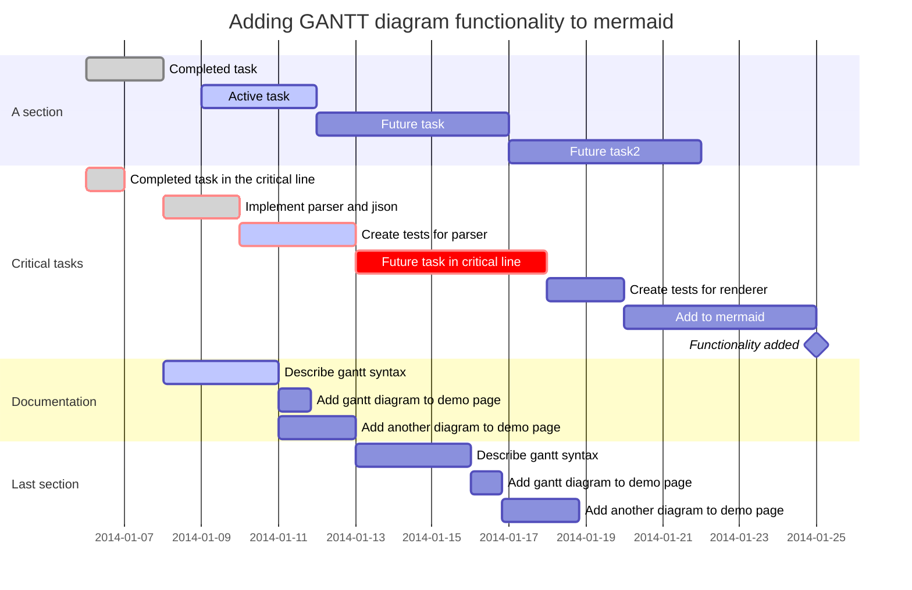

# Formatter for Mermaid Gantt Charts

## Before

```mmd
%% timeline.mmd
gantt
    title Adding GANTT diagram functionality to mermaid
  dateFormat YYYY-MM-DD

    section A section
    Completed task  :done,  des1, 2014-01-06,2014-01-08
    Active task  :active, des2, 2014-01-09, 3d
    Future task  :  des3, after des2, 5d
    Future task2  :   des4, after des3, 5d
    section Critical tasks
    Completed task in the critical line   :crit, done, 2014-01-06,24h
    Implement parser and jison  :crit, done, after des1, 2d
    Create tests for parser   :crit, active, 3d
    Future task in critical line  :crit, 5d
    Create tests for renderer   :2d
    Add to mermaid  :until isadded
    Functionality added   :milestone, isadded, 2014-01-25, 0d
    section Documentation
    Describe gantt syntax  :active, a1, after des1, 3d
    Add gantt diagram to demo page   :after a1  , 20h
    Add another diagram to demo page    :doc1, after a1  , 48h


    section Last section
    Describe gantt syntax   :after doc1, 3d
    Add gantt diagram to demo page    :20h
    Add another diagram to demo page    :48h
```

## Build

```sh
# windows
cargo build --release --target x86_64-pc-windows-msvc
chmod +x target/x86_64-pc-windows-msvc/release/fmt-mmd-gantt.exe
mv target/x86_64-pc-windows-msvc/release/fmt-mmd-gantt.exe .

# linux
cargo build --release --target x86_64-unknown-linux-gnu
chmod +x target/x86_64-unknown-linux-gnu/release/fmt-mmd-gantt
mv target/x86_64-unknown-linux-gnu/release/fmt-mmd-gantt .
```

## Run

```shell
# windows
./fmt-mmd-gantt.exe timeline.mmd # edited in-place
./fmt-mmd-gantt.exe timeline.mmd out.mmd # write to destination

# linux
./fmt-mmd-gantt timeline.mmd
./fmt-mmd-gantt timeline.mmd out.mmd
```

## After

```mmd
gantt
  title Adding GANTT diagram functionality to mermaid
  dateFormat YYYY-MM-DD

  section A section
    Completed task                       : done  ,                     des1   ,  2014-01-06,  2014-01-08
    Active task                          : active,                     des2   ,  2014-01-09,  3d
    Future task                          :                             des3   ,  after des2,  5d
    Future task2                         :                             des4   ,  after des3,  5d

  section Critical tasks
    Completed task in the critical line  : done  ,  crit,                        2014-01-06,  24h
    Implement parser and jison           : done  ,  crit,                        after des1,  2d
    Create tests for parser              : active,  crit,                                     3d
    Future task in critical line         :          crit,                                     5d
    Create tests for renderer            :                                                    2d
    Add to mermaid                       :                                                    until isadded
    Functionality added                  :                 milestone,  isadded,  2014-01-25,  0d

  section Documentation
    Describe gantt syntax                : active,                     a1     ,  after des1,  3d
    Add gantt diagram to demo page       :                                       after a1  ,  20h
    Add another diagram to demo page     :                             doc1   ,  after a1  ,  48h

  section Last section
    Describe gantt syntax                :                                       after doc1,  3d
    Add gantt diagram to demo page       :                                                    20h
    Add another diagram to demo page     :                                                    48h
```

---


