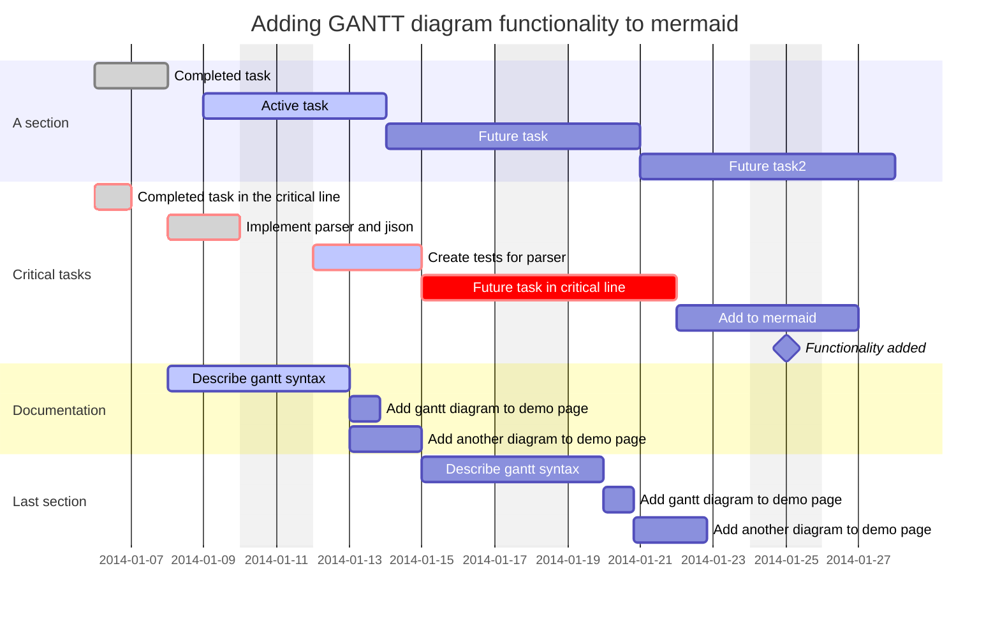

# Formatter for Mermaid Gantt Charts

<!--toc:start-->

- [Install](#install)
- [Usage](#usage)
- [Example](#example)

<!--toc:end-->

## Install

### #1: cargo

```sh
cargo install --git https://github.com/ayvi-0001/mermaid-gantt-formatter
```

### #2: [release](https://github.com/ayvi-0001/mermaid-gantt-formatter/releases)

### #3: source

```sh
git clone https://github.com/ayvi-0001/mermaid-gantt-formatter.git
cd mermaid-gantt-formatter

# install directly
cargo install --path .

# or build
cargo build --release
chmod +x target/release/mmdc-fmt
# (optional) add to path
mkdir -p ~/bin
mv target/release/mmdc-fmt ~/bin
PATH+=:~/bin
export PATH
```

## Usage

```sh
# read from stdin (default), print to stdout
cat gantt_chart.mmd | mmdc-fmt


# read file, print to stdout
mmdc-fmt -i gantt_chart.mmd


# format file in-place
mmdc-fmt -i gantt_chart.mmd -I


# write output to new file
mmdc-fmt -i gantt_chart.mmd -o out.mmd
```

> [!NOTE]
> There is an option for the 'type' of formatter to use. Currently, the only choice is `gantt`,
> which is selected by default and can be omitted. This option only exists in case I or someone else decide
> to add on another formatter for a different mermaid diagram.

## Example

### Before

```mmd
gantt
    dateFormat  YYYY-MM-DD
  title       Adding GANTT diagram functionality to mermaid
    %% (`excludes` accepts specific dates in YYYY-MM-DD format, days of the week ("sunday") or "weekends", but not the word "weekdays".)
     excludes    weekends
%%    Weekend (v\11.0.0+)
    weekend friday
    %% Do first
    section A section
    Completed task :done,    des1, 2014-01-06,2014-01-08
    Active task :active,  des2, 2014-01-09, 3d
    Future task  :         des3, after des2, 5d
    Future task2 :         des4, after des3, 5d
    section Critical tasks
      Completed task in the critical line :crit, done, 2014-01-06,24h
    Implement parser and jison  :crit, done, after des1, 2d
    Create tests for parser  :crit, active, 3d
    Future task in critical line  :crit, 5d
%%   Create tests for renderer  :2d
   Add to mermaid       :until isadded
    Functionality added :milestone, isadded, 2014-01-25, 0d

    section Documentation
    Describe gantt syntax  :active, a1, after des1, 3d
    Add gantt diagram to demo page :after a1  , 20h
    Add another diagram to demo page :doc1, after a1  , 48h


    section Last section
   %%Refer to section Documentation
    Describe gantt syntax            :after doc1, 3d
    Add gantt diagram to demo page   :20h
    Add another diagram to demo page :48h
```

### After

```mmd
gantt
  dateFormat YYYY-MM-DD
  title Adding GANTT diagram functionality to mermaid
  %% (`excludes` accepts specific dates in YYYY-MM-DD format, days of the week ("sunday") or "weekends", but not the word "weekdays".)
  excludes weekends
  %% Weekend (v\11.0.0+)
  weekend friday

%% Do first
  section A section
    Completed task                      : done  ,                  des1   , 2014-01-06, 2014-01-08
    Active task                         : active,                  des2   , 2014-01-09, 3d
    Future task                         :                          des3   , after des2, 5d
    Future task2                        :                          des4   , after des3, 5d

  section Critical tasks
    Completed task in the critical line : done  , crit,                     2014-01-06, 24h
    Implement parser and jison          : done  , crit,                     after des1, 2d
    Create tests for parser             : active, crit,                     3d
    Future task in critical line        :         crit,                     5d
%%  Create tests for renderer           :                                   2d
    Add to mermaid                      :                                   until isadded
    Functionality added                 :               milestone, isadded, 2014-01-25, 0d

  section Documentation
    Describe gantt syntax               : active,                  a1     , after des1, 3d
    Add gantt diagram to demo page      :                                   after a1  , 20h
    Add another diagram to demo page    :                          doc1   , after a1  , 48h

  section Last section
%%  Refer to section Documentation
    Describe gantt syntax               :                                   after doc1, 3d
    Add gantt diagram to demo page      :                                   20h
    Add another diagram to demo page    :                                   48h
```

---


```mermaid
gantt
  dateFormat YYYY-MM-DD
  title Adding GANTT diagram functionality to mermaid
  %% (`excludes` accepts specific dates in YYYY-MM-DD format, days of the week ("sunday") or "weekends", but not the word "weekdays".)
  excludes weekends
  %% Weekend (v\11.0.0+)
  weekend friday

%% Do first
  section A section
    Completed task                      : done  ,                  des1   , 2014-01-06, 2014-01-08
    Active task                         : active,                  des2   , 2014-01-09, 3d
    Future task                         :                          des3   , after des2, 5d
    Future task2                        :                          des4   , after des3, 5d

  section Critical tasks
    Completed task in the critical line : done  , crit,                     2014-01-06, 24h
    Implement parser and jison          : done  , crit,                     after des1, 2d
    Create tests for parser             : active, crit,                     3d
    Future task in critical line        :         crit,                     5d
%%  Create tests for renderer           :                                   2d
    Add to mermaid                      :                                   until isadded
    Functionality added                 :               milestone, isadded, 2014-01-25, 0d

  section Documentation
    Describe gantt syntax               : active,                  a1     , after des1, 3d
    Add gantt diagram to demo page      :                                   after a1  , 20h
    Add another diagram to demo page    :                          doc1   , after a1  , 48h

  section Last section
%%  Refer to section Documentation
    Describe gantt syntax               :                                   after doc1, 3d
    Add gantt diagram to demo page      :                                   20h
    Add another diagram to demo page    :                                   48h
```
